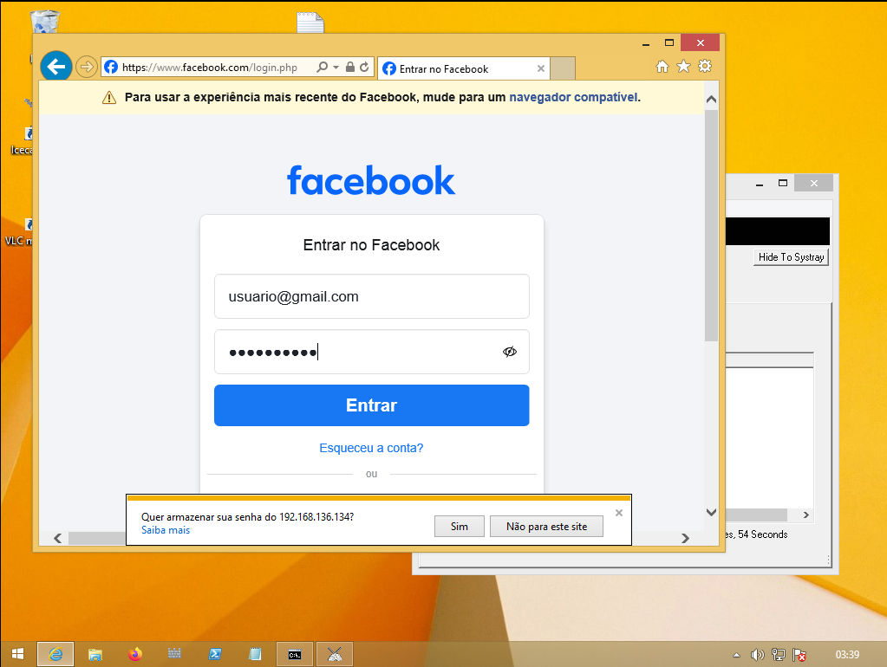

# Resltado do Desafio Phishing para captura de senhas do Facebook (DIO) 

### Ferramentas

- Kali Linux
- setoolkit

### Configurando o Phishing no Kali Linux

- Acesso root: ``` sudo su ```
- Iniciando o setoolkit: ``` setoolkit ```
- Tipo de ataque: ``` Social-Engineering Attacks ```
  


- Vetor de ataque: ``` Web Site Attack Vectors ```
- Método de ataque: ```Credential Harvester Attack Method ```
  

- Método de ataque: ``` Site Cloner ```
- Obtendo o endereço da máquina: ``` ifconfig ```
- URL para clone: http://www.facebook.com
  


### Resutados

- URL http://www.facebook.com ativada no IP 192.168.136.134
  


- URL http://www.facebook.com acessada de outra VM
  


- URL http://www.facebook.com utilizada pela vítima
  


- Dados de login da vítima capturados
  

